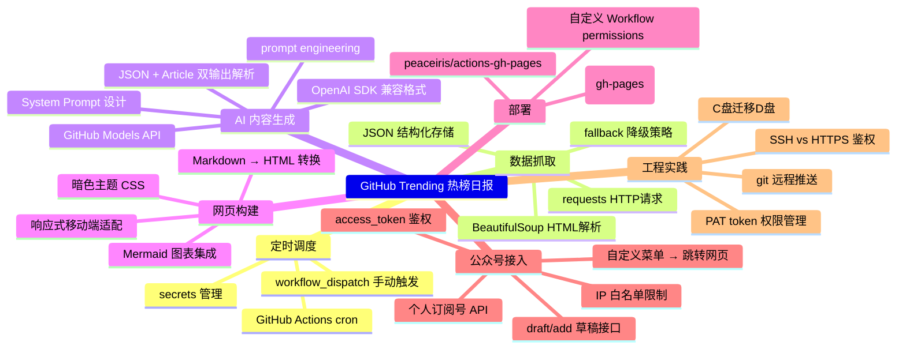

# GitHub Trending 微信热榜日报 — 知识复盘

> 复盘日期：2026-06-30  |  标签：`#GitHubActions` `#GitHubPages` `#AI应用` `#微信开发` `#PromptEngineering` `#自动化`

---

## 📋 一页概览

**做了一个全自动的 GitHub 热榜日报：每天早上 9 点抓取 Trending Top 10，AI 润色为文章，生成暗色主题网页，部署到 GitHub Pages，公众号菜单一键跳转。**

技术栈关键词：Python · GitHub Actions · GitHub Models (Llama 3.3 70B) · GitHub Pages · BeautifulSoup · OpenAI SDK · Markdown → HTML · 微信公众号自定义菜单 · Skill 系统

---

## 🗺️ 知识地图



---

## 🧠 第一层：收获

### 核心概念

| 概念 | 一句话 | 在这个项目里 | 熟练度 |
|------|--------|-------------|--------|
| GitHub Actions | GitHub 提供的免费 CI/CD 服务，按 cron 表达式定时运行任务 | 用 cron `0 1 * * *` 实现每天 9 点自动执行 | 🟢 |
| GitHub Models | GitHub 免费 AI 模型市场，兼容 OpenAI SDK | 用 Llama 3.3 70B 生成文章，零费用 | 🟡 |
| GitHub Pages | GitHub 免费静态网站托管 | 通过 peaceiris action 部署到 gh-pages 分支 | 🟢 |
| Prompt Engineering | 设计 System Prompt 来控制 AI 输出质量和格式 | 写了 JSON + Article 双输出模板，含领域标签和亮点抽取 | 🟡 |
| Web Scraping | 用 BeautifulSoup 从 HTML 页面提取结构化数据 | 解析 GitHub Trending 页面，提取项目名/Star/描述/语言 | 🟢 |
| 微信公众号 API | 通过 REST API 创建草稿、发布文章 | 经历了 IP 白名单拦截、AppSecret 未启用等问题 | 🟡 |
| Skill 系统 | Claude Code 的可安装能力扩展机制 | 创建了 knowledge-summary skill，三层复盘法 | 🟡 |
| git remote + PAT 认证 | 用 Personal Access Token 代替密码推送代码 | 解决 SSH 不通、token 权限不足（repo + workflow） | 🟢 |

### 新工具

| 工具 | 干什么的 | 替代品 | 值得深学吗 |
|------|---------|--------|-----------|
| peaceiris/actions-gh-pages | GitHub Action，自动部署到 gh-pages 分支 | 手动 `git push origin gh-pages` | ✅ 项目标配 |
| GitHub Models | 免费 LLM API，兼容 OpenAI SDK | Anthropic API、DeepSeek | ✅ 推荐 |
| BeautifulSoup+lxml | Python HTML 解析 | Scrapy、Selenium、Playwright | ✅ 经典必备 |
| `npx skills` CLI | Skill 包管理器，安装/搜索/打包 | 手动创建文件 | ✅ 知道就行 |
| Mermaid mindmap | ASCII 画不出的知识图谱，GitHub 原生渲染 | draw.io、Excalidraw | ✅ 文档加分 |

### 踩坑记录

| # | 遇到了什么 | 根因 | 怎么解决的 | 以后怎么避免 |
|---|-----------|------|-----------|-------------|
| 1 | 微信 API 报 `40164 invalid ip` | 微信公众号要求调用方 IP 在安全白名单中，GitHub Actions 出口 IP 不固定 | 加 `0.0.0.0/0` 到白名单（需先启用 AppSecret） | 涉及微信开发的线上服务要么申请固定 IP，要么把发布逻辑放本地 |
| 2 | 微信 AppSecret 显示「未启用开发者密码」 | 个人订阅号默认关闭开发者密码，需管理员微信扫码激活 | 扫码→启用→重置→拿到新 Secret | 注册完公众号第一件事就是启用开发者密码 |
| 3 | 微信公众号菜单不允许外链 | 个人订阅号菜单不支持直接跳转外部 URL | 改用「关键词自动回复」：用户发「热榜」→ 回复链接 | 个人号功能严重受限，重大功能走企业号 |
| 4 | GitHub 推送失败 `403 workflow scope` | Personal Access Token 创建时没勾 workflow 权限 | 在 [tokens 页面](https://github.com/settings/tokens) 编辑 token 勾上 workflow | 创建 token 时 repo 和 workflow 都要勾 |
| 5 | Actions 报 `ValueError: I/O operation on closed file` | `sys.stdout.buffer` 在 Linux runner 上行为不同，强行 wrap 导致 print 崩溃 | 直接删掉 stdout 编码 wrap——Ubuntu runner 默认就是 UTF-8 | 处理编码问题只针对 Windows 本地，加 try/except 或者用环境变量判断平台 |
| 6 | pip install lxml 下载超时 | lxml wheel 有 4MB，国内网络下载慢 | 改用 Python 内置 `html.parser` 做 fallback，不强制依赖 lxml | 依赖越小越好，能用标准库就别装第三方包 |

### 可复用模式

1. **GitHub Actions + GitHub Pages 免费部署模式**：`.github/workflows/*.yml` 里三步搞定——checkout → 生成静态文件 → `peaceiris/actions-gh-pages@v4` 部署。比买服务器省事 100 倍。

2. **AI 生成 JSON + 文章双输出模式**：prompt 先要 JSON（结构化数据），再用 `===ARTICLE===` 分隔符输出文章。一次 API 调用同时拿到两种格式，比调两次省钱。

3. **获取 GitHub Trending 的 fallback 链**：`requests → BeautifulSoup 解析 → 如果失败 → 用 fallback 数据 → 至少不中断`。所有依赖外部数据的自动化项目都应该有这个模式。

4. **Windows 编码问题处理**：永远不要在跨平台 Python 代码里强行 wrap stdout。本地 Windows 用 `sys.stdout.reconfigure(encoding='utf-8')`，CI 环境什么都不用做。

5. **工作流文件里的 `permissions: contents: write`**：GitHub Actions 默认 `GITHUB_TOKEN` 是只读的，要 push 或部署就得显式声明这个权限。记住就行。

### 代码可复用片段

**GitHub Pages 部署 Action 模板**（复制到 `.github/workflows/` 直接可用）：

```yaml
name: Deploy to Pages
on:
  schedule: [{cron: '0 1 * * *'}]
  workflow_dispatch:
jobs:
  deploy:
    runs-on: ubuntu-latest
    permissions: {contents: write}
    steps:
      - uses: actions/checkout@v4
      - uses: actions/setup-python@v5
        with: {python-version: '3.12'}
      - run: pip install -r requirements.txt && python main.py
      - uses: peaceiris/actions-gh-pages@v4
        with:
          github_token: ${{ secrets.GITHUB_TOKEN }}
          publish_dir: ./docs
```

---

## 🔴 第二层：盲点

### 用了但没真懂

| 内容 | 你在哪用它 | 为什么没懂 | 建议怎么补 |
|------|-----------|-----------|-----------|
| `peaceiris/actions-gh-pages` 内部原理 | 部署步骤 | 只知道它能部署，不知道它是怎么创建/更新 gh-pages 分支的 | 看它的 GitHub 仓库 README，源码不到 200 行 |
| OpenAI SDK 的 `chat.completions.create` 背后细节 | generate_article.py | 会用但不知道 `temperature`、`max_tokens`、`top_p` 的精确含义和调参技巧 | 读 OpenAI 官方 API 文档的 Chat 部分，30 分钟 |
| Mermaid 语法 | 知识地图 | AI 帮你写的 mermaid 图，你能看懂但自己写不出一张 | mermaid.live 上画 5 分钟就会 |
| GitHub Pages 的 DNS/CNAME 自定义域名 | 没用 | 现在用的是 `mrji55.github.io` 子域名，如果你以后想绑自己的域名，完全不会 | 搜 "GitHub Pages custom domain"，5 分钟能配完 |
| Prompt 里「JSON + 分隔符」双输出格式的可靠性 | 核心 Prompt | AI 不一定每次都严格遵守格式，但你没验证边界的容错逻辑够不够 | 加几个异常 case 手动测试 |

### 绕过去没碰

- **CI/CD 通知机制**：Actions 跑完是成功还是失败，完全依赖 GitHub 网页看。成熟的自动化项目应该加飞书/钉钉/邮件通知。
- **自动化测试**：一次性写完代码就上线了，没有写任何单元测试。fetch_trending.py 的 HTML 解析逻辑、generate_article.py 的 JSON 解析逻辑，都属于「改一行就可能悄悄崩掉」的高风险区域。

### 应该懂但没深究

- **`sys.stdout.buffer` 到底是什么**：导致两次报错的那个编码问题，其实反映的是对 Python I/O 层的理解不够。`TextIOWrapper`、`BufferedWriter`、`FileIO` 这三层是怎么回事。
- **actions/checkout 的 fetch-depth**：Workflow 每次都 clone 完整仓库，如果以后仓库大了会很慢。`fetch-depth: 1` 是什么意思，什么时候该用。

---

## ➡️ 第三层：路径

### 能力雷达

```
        自动化/CI-CD
            ██████░░ 60%

    Prompt Engineering     │     Web Scraper
        ██████░░ 55%       │    ████████ 75%
                            │
                  ┌─────────┴────────┐
    微信API/SDK     │                  │   前端/HTML-CSS
    ████░░ 35%      │                  │   ████░░ 40%
                    │                  │
            Python 工程化
            ████░░ 35%
```

**解读**：这是你第一次从零搭一个完整的自动化内容 pipeline。Scraper 和 CI/CD 维度收获最大，微信 API 因为踩了不少坑所以有体感但熟练度不高。Python 工程化（测试、错误处理、日志）是明显的短板——代码能跑，但不经折腾。

### 下一步该学什么

1. **🔥 优先级最高：Python 错误处理与测试**
   因为：你的项目现在没有任何测试，fetch_trending 的 HTML 解析一旦 GitHub 改页面结构就会静默失败（fallback 数据能兜底但你看不见问题）。学会写 2-3 个 pytest 测试用例，知道 `try/except` 的最佳实践。  
   从：[pytest 官方 tutorial](https://docs.pytest.org/en/latest/getting-started.html) 开始，预计 1-2 小时。

2. **🌟 重要但不急：GitHub Actions 进阶**
   因为：你已经会 cron 定时、手动触发、secrets 管理。下一步该学 artifact 管理、多 job 依赖、matrix builds、SLA 监控。  
   从：GitHub Actions 官方文档的 Workflow syntax 页面，预计 1 小时。

3. **💡 有余力再看：把 pipeline 迁移到结构化 CMS**
   因为：目前是每天覆盖 `index.html`，归档靠文件夹。如果以后想做搜索、RSS、邮件订阅，需要把内容存到数据库或 CMS 里。  
   从：搜 "static site CMS headless" 了解可选方案，预计 30 分钟了解概念。

### 费曼自检

1. 如果一个不懂编程的朋友问你「GitHub Actions 是什么」，你能不用「CI/CD」「cron」「workflow」这些词，用大白话解释清楚吗？
2. 如果 GitHub Models 明天停止免费服务了，你最少改几处代码能换到 DeepSeek API？具体改哪个文件、哪几行？
3. 这个项目最大的设计妥协是「放弃了微信主动推送，改为网页跳转」。如果重新来一次，从一开始就不用微信推送路线，这个项目可以再简化多少？对你做下一个类似项目的决策有什么指导意义？

---

## 📚 延伸资源

- [GitHub Actions Workflow Syntax](https://docs.github.com/en/actions/writing-workflows/workflow-syntax-for-github-actions)
- [OpenAI Chat Completions API](https://platform.openai.com/docs/guides/chat-completions)
- [GitHub Pages Custom Domain](https://docs.github.com/en/pages/configuring-a-custom-domain-for-your-github-pages-site)
- [pytest Getting Started](https://docs.pytest.org/en/latest/getting-started.html)
- [Mermaid Live Editor](https://mermaid.live)
- 搜索关键词：`GitHub Actions error notification` `BeautifulSoup anti-bot` `Python sys.stdout encoding linux`

---

## 🏷️ 标签

`#GitHubActions` `#GitHubPages` `#GitHubModels` `#微信开发` `#WebScraping` `#Python` `#PromptEngineering` `#自动化` `#Skill`

---

> ⏭ 下次复盘时，回顾上面的「下一步该学什么」——你实际学了哪些？雷达图有进步吗？
